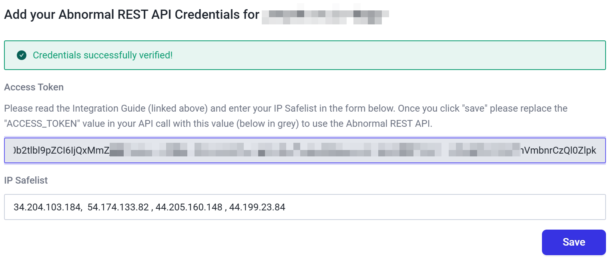
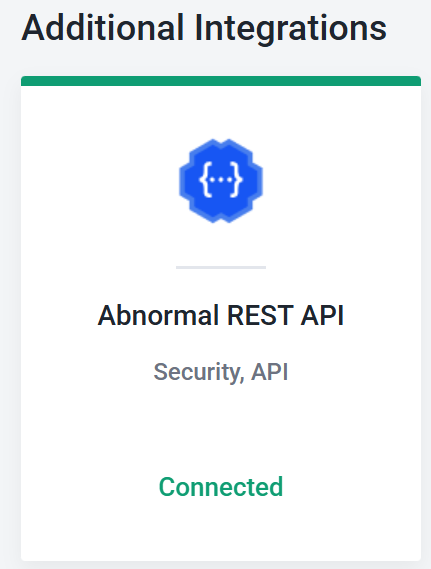

# Search the Abnormal Threat Log via API

threats-with-attachments-list-attchment-name.py will pull a list of up to 2000 threat campaigns (via “pageSize=2000” query parameter), between a specific date range, that contain attachments (via "attackVector=Attachment" query parameter), then iterate through each threat campaign and pull the attachment name.


# Output Example

Script output contains a line for each campaign, for example here’s 3 campaigns, one email with attachment belonging to each: 


```
{"attachments": [{"abxMessageIdStr": "-2330780201764809468", "abxMessageId": -2330780201764809468, "attachmentName": "FAK060344.pdf"}]}
{"attachments": [{"abxMessageIdStr": "-9219709620850343380", "abxMessageId": -9219709620850343380, "attachmentName": "Buongio 88.jpeg"}]}
{"attachments": [{"abxMessageIdStr": "-208404018029961834", "abxMessageId": -208404018029961834, "attachmentName": "invitation flyer.pdf"}]}
```


If multiple emails belong to one campaign, all emails with attachments in a single campaign will be are shown on one line e.g. 


```
{"attachments": [{"abxMessageIdStr": "-6352395183825384511", "abxMessageId": -6352395183825384511, "attachmentName": "Outlook-gvpruhfg.jpg"}, {"abxMessageIdStr": "342468769159544956", "abxMessageId": 342468769159544956, "attachmentName": "Outlook-gkiap4so.jpg"}, {"abxMessageIdStr": "-5801738121738969677", "abxMessageId": -5801738121738969677, "attachmentName": "Outlook-k4ctri1a.jpg"}, {"abxMessageIdStr": "266011346408465016", "abxMessageId": 266011346408465016, "attachmentName": "Outlook-xilssncg.jpg"}, {"abxMessageIdStr": "-4277971300791136074", "abxMessageId": -4277971300791136074, "attachmentName": "Outlook-jkb0zfa1.jpg"}, {"abxMessageIdStr": "9089939857321245185", "abxMessageId": 9089939857321245185, "attachmentName": "Outlook-vruohwqv.jpg"}]}
```


Reformatting this we see the unique abxMessageId with attachment name on each line:


```
{"attachments": [
    {"abxMessageIdStr": "-6352395183825384511", "abxMessageId": -6352395183825384511, "attachmentName": "Outlook-gvpruhfg.jpg"},
    {"abxMessageIdStr": "342468769159544956", "abxMessageId": 342468769159544956, "attachmentName": "Outlook-gkiap4so.jpg"}, 
    {"abxMessageIdStr": "-5801738121738969677", "abxMessageId": -5801738121738969677, "attachmentName": "Outlook-k4ctri1a.jpg"}, 
    {"abxMessageIdStr": "266011346408465016", "abxMessageId": 266011346408465016, "attachmentName": "Outlook-xilssncg.jpg"}, 
    {"abxMessageIdStr": "-4277971300791136074", "abxMessageId": -4277971300791136074, "attachmentName": "Outlook-jkb0zfa1.jpg"}, 
    {"abxMessageIdStr": "9089939857321245185", "abxMessageId": 9089939857321245185, "attachmentName": "Outlook-vruohwqv.jpg"}
]
}
```


The abxMessageId value can be used in the Abnormal portal to retrieve the threat log entry in question e.g.:

https://portal.abnormalsecurity.com/home/threat-center/remediation-history/&lt;abxMessageId>


# Setup


## Step 1 - Determine Source IP Address for you API Calls

API calls from your home or office:


1. Use “[whatismyip.com](whatismyip.com)” to determine your current public IP
2. If your ISP uses CGNAT and thus varies your public IP, you can use a shorter net-mask on your public IP to cover a broader ranges of addresses e.g. 1.2.3.4 can be expressed as 1.2.3.0/24 for a class C (255 IPs) or 1.2.2.0/23 for 512 IPs, etc

API calls from Swagger Hub


1. Swagger hub will make API calls from: 34.204.103.184, 54.174.133.82, 44.205.160.148, and 44.199.23.84 (see [SwaggerHub Portal IP Addresses](https://support.smartbear.com/swaggerhub/docs/en/ip-addresses.html) for latest list)


## Step 2 - Configure API Token in Abnormal for your target tenant


1. Settings > Integrations > Abnormal Rest API > Click “Connected”  \


<p id="gdcalert1" ><span style="color: red; font-weight: bold">>>>>>  gd2md-html alert: inline image link here (to images/image1.png). Store image on your image server and adjust path/filename/extension if necessary. </span><br>(<a href="#">Back to top</a>)(<a href="#gdcalert2">Next alert</a>)<br><span style="color: red; font-weight: bold">>>>>> </span></p>




2. Click in the Access Token field to reveal the Access Token \


<p id="gdcalert2" ><span style="color: red; font-weight: bold">>>>>>  gd2md-html alert: inline image link here (to images/image2.png). Store image on your image server and adjust path/filename/extension if necessary. </span><br>(<a href="#">Back to top</a>)(<a href="#gdcalert3">Next alert</a>)<br><span style="color: red; font-weight: bold">>>>>> </span></p>




    1. highlight and save the token into a file that's accessible to your Python script
    2. Set the ip addresses from Step 1 for the IP Safelist (Swagger Hub portal IPs shown)


## Step 3 - Run the Script


### Syntax


```
$ python script.py <bearer_token_file> <start_date> <end_date>
```


Where [script.py](script.py) is [threats-with-attachments-list-attchment-name.py](threats-with-attachments-list-attchment-name.py), bearer_token_file is the file you saved in step 2 and date is in format YYYY-MM-DD


### Example


```
$ py threats-with-attachments-list-attchment-name.py token-viking.txt 2025-04-01 2025-07-31

{"attachments": [{"abxMessageIdStr": "-5701233357971916900", "abxMessageId": -5701233357971916900, "attachmentName": "e977ec9ea613e40323d50e479d7a.png"}]}
{"attachments": [{"abxMessageIdStr": "1189964449225433073", "abxMessageId": 1189964449225433073, "attachmentName": "Outlook-erd0xtna.png"}, {"abxMessageIdStr": "1189964449225433073", "abxMessageId": 1189964449225433073, "attachmentName": "EMPLOYMENT AND LABOUR RFQ_EV200GD VACUUM CLEANER (1).pdf"}]}
{"attachments": [{"abxMessageIdStr": "-3226709249171028084", "abxMessageId": -3226709249171028084, "attachmentName": "lyqgmtym.pdf"}]}
{"attachments": [{"abxMessageIdStr": "5771087220439252456", "abxMessageId": 5771087220439252456, "attachmentName": "pdwhq.pdf"}]}
{"attachments": [{"abxMessageIdStr": "-4586319328840499332", "abxMessageId": -4586319328840499332, "attachmentName": "rrgbtug.pdf"}]}
{"attachments": [{"abxMessageIdStr": "6403694058107961952", "abxMessageId": 6403694058107961952, "attachmentName": "vifsa.pdf"}]}
{"attachments": [{"abxMessageIdStr": "-7178410274853794081", "abxMessageId": -7178410274853794081, "attachmentName": "SACAA REQUEST FOR QUOTATION.pdf"}]}
Fetching attachment name for threats in specified date range 7/7
```


Output can also be sent to a file e.g. 


```
$ py threats-with-attachments-list-attchment-name.py token-viking.txt 2025-04-01 2025-07-31 > attachment_list_output.txt
